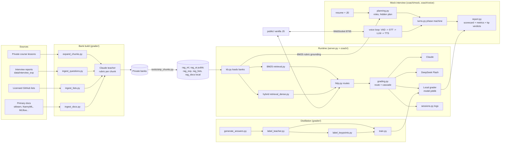

# Project Report — MLE/AIE Interview Coach

Written 2026-09-06 against local `main` at commit `e15c43e` (92 commits since
2026-08-01, 152 tracked files, ~16.8k lines of Python). Every number below
names its source file; where a number exists only in prose (README or a plan)
and not in a committed results file, the table says so. Statements marked
*(inference)* are reasonable readings of the files, not facts verified in
them.

---

## 1. Executive Summary

**What the project does.** A local web app for practicing Machine Learning
Engineer (MLE) and AI Engineer (AIE) interviews. It has two surfaces
(`docs/specification.md` §1): *question practice* — a curated, rubric-graded
question is served, timed, graded against its rubric, and returned with a
score, subscores, strengths, gaps, a stronger sample answer and a follow-up —
and an *AI mock interview* — a multi-phase interview driven by an LLM persona
built from the user's resume and a job description, typed or over a live
voice loop (streaming STT, endpointing, barge-in, streamed TTS), ending in a
three-block report.

**The problem it solves.** Interview prep tools grade against nothing in
particular; this one grades against per-question rubrics (model answer, key
points, common mistakes) derived from course material, real interview reports,
licensed public question lists and primary documentation, so feedback is
grounded in what a strong answer actually contains. The second problem it
attacks is cost: three grading engines with measured agreement let a free tier
run at zero marginal cost on a distilled scikit-learn model while paid
requests use DeepSeek Flash by default and Claude under a daily quota
(`docs/specification.md` §1 table, `coach/grading.py`).

**Who might use it.** The author (single-user by default), a handful of
invited users through `users.json` access keys (freemium demo), and readers of
the repository as an end-to-end LLM + classical-ML case study — the README
frames it explicitly that way (`README.md:41-47`).

**Current stage.** Feature-complete for local use; all planned phases of the
mock interview (0–3) are recorded as done in `docs/plan.md` §1.2–1.5;
the bank-growth programme in `docs/plan.md` §1.8 finished on
2026-09-06 with a negative result on rubric grounding. Deployment is *parked*
(`docs/specification.md:377`). The public GitHub repository is 15 commits
behind this working copy (`git rev-list --count origin/main..main` = 15), so
the CI badge and the public tree reflect the state before the last week of
bank growth.

**Strongest features.**
- Every shipped component carries a held-out measurement and every rejected
  design is documented as a negative result: hybrid retrieval shipped under a
  pre-registered rule (`docs/plan.md` §1.7, results in
  `grader/retrieval_eval_results.json`); the Deepgram voice stack was built,
  harnessed and rejected (`grader/loop_eval_results.json`); a stacked scorer
  and an intuitive cascade rule were measured and declined (`README.md:413-416,
  221-229`).
- A distilled local grader (598 Claude gold labels, grouped split by question)
  with a per-key-point verdict classifier that powers the hit/miss feedback
  (`grader/train.py`, `grader/model.joblib`).
- Five question banks under one schema with provenance, license texts and a
  review flag the loader honours (`coach/config.py:15-27`, `coach/kb.py:53-56`,
  `tools/review_bank.py`).
- A voice loop measured end to end with real recordings, including the
  end-of-turn silence sweep and barge-in (`grader/loop_eval.py`).
- Zero-dependency serving: stdlib HTTP server, vanilla-JS frontend, no build
  step (`server.py:17`, `public/`).

**Most important limitations.**
- No authentication on the grading endpoints; in the default single-user
  configuration every anonymous `POST /api/evaluate` spends Claude credits
  (`coach/grading.py:47`; the README says so at `README.md:169-171`).
- The Docker image is incomplete: it does not copy `retrieval_dense.py`,
  `resume_parser.py`, `grader/stt_text.py` or the three optional banks
  (`docker/backend.Dockerfile:11-18`), so the container silently serves BM25
  only and resume upload would fail.
- Rubric grounding for the mock interview fails its own bar: the best policy
  attaches a fair rubric to 44% of probes (`grader/grounding_r4_results_grown.json`),
  and the labels behind that number were made by the assistant, not the
  author (`grader/grounding_r4_labels.json` `labeler`).
- Several headline metrics (distilled-grader MAE/QWK, judge agreement, cascade
  rule) exist only in README prose; the scripts print them and write no file.
- No type hints, no `logging`, no linter or type checker anywhere
  (evidence in §8).

---

## 2. Project Goals and Scope

**Primary objective.** Rubric-grounded interview practice for MLE/AIE roles
at three cost points, with every component's quality measured before it
ships (`docs/specification.md` §1, §10).

**Intended use cases.**
1. Timed answer practice against bank questions or LLM-generated questions,
   with structured grading and follow-ups (`README.md` "What it does").
2. A resume-driven mock interview round (experience/project deep dive) in
   text, browser-voice or live-voice mode (`README.md` "AI mock interview").
3. A freemium demo where free users get the local grader and paid keys get
   LLM grading under quota (`README.md` "Free and paid tiers").
4. A case study: the experiments in `grader/` and `docs/` are first-class
   deliverables.

**Inputs and outputs.**

| Surface | Inputs | Outputs |
|---|---|---|
| Practice | track, level, topic/module, optional focus text, typed or dictated answer; optional `X-Access-Key` | question (bank chunk or generated), evaluation JSON (score 1–10, four subscores, strengths, gaps, stronger answer, next steps, follow-up), "graded by" engine, key-point hit/miss list |
| Mock | resume text (or PDF/.docx upload), optional JD, style, length, opt-in logging | role proposals, hidden plan, interviewer turns (text + optional audio), report (LLM scorecard, deterministic communication metrics, key-point verdicts), downloadable markdown |
| Voice loop | microphone PCM over WebSocket (`public/mock-audio-worklet.js`) | live transcript, streamed TTS sentences, per-answer recordings re-transcribed for the report |

**Functional requirements (as documented).** Backend and frontend contracts
are written down in `docs/backend.md` and `docs/frontend.md`: a three-endpoint
JSON API for practice (`/api/meta`, `/api/question`, `/api/evaluate`), the
`/api/mock/*` family, no corpus content hard-coded in the frontend,
fail-closed tiers, no self-distillation (free-tier answers are logged
unlabeled), opt-in mock logging.

**Non-functional requirements (as documented and measured).** Retrieval
p95 under 50 ms and model under 200 MB (rule R1, `docs/plan.md`
§2); first agent audio within 2.0 s (`docs/specification.md:298-300`);
backend RSS that fits a small host (measured 232.9 MB with the embedding
model, `grader/retrieval_eval_results.json` `memory`); no personal data in
the public repository (`README.md` "Data and privacy").

**Features currently implemented (verified in code).** Practice flow with
bookmarks and follow-ups (`coach/http.py`, `public/app.js`); five banks with
hybrid or BM25 retrieval and auto-detection (`coach/kb.py`, `retrieval.py`,
`retrieval_dense.py`); three LLM engines plus the local grader with the
cascade (`coach/llm.py`, `coach/grading.py`); tiers, quota and hot-reloaded
keys (`coach/users.py`); session logging (`coach/sessions.py`); the mock
interview with plan cache, phase machine, report and two-transcript
accounting (`coach/mock/*`); the live voice loop with four STT/TTS backends,
Silero VAD endpointing, sentence chunking, keyterm policy and the Level 1
sidecar (`coach/voice/*`); Docker compose with nginx (`docker/`); the
distillation pipeline and nine experiment harnesses (`grader/`); bank build,
review, strip and private-backup tools (`grader/ingest_*.py`,
`grader/expand_chunks.py`, `tools/`).

**Planned but unfinished (verified in docs).**
- Deployment with TLS and a domain: itemised as 3a/3b/3c in
  `docs/plan.md` §1.10; not built. EC2 run is "currently
  parked" (`docs/specification.md:377`).
- MLE lesson-text expansion stage B (22 keeps, ≈ $0.73): "not run"
  (`docs/plan.md` §1.8).
- Beyond-resume mock probes: frozen behind `MOCK_BEYOND_RESUME`
  (`coach/config.py:102`) until a bank of beyond-resume questions exists.
- The grounding follow-up the post-growth run recommends — grading the mock
  against the probe's own expected points with bank chunks as hints — is
  "a product decision recorded here, not made" (`docs/plan.md`
  §12.4 post-growth paragraph).
- Author spot-check of the assistant-made grounding labels: "pending" in
  `grader/grounding_eval_results.json` `labeler` and never recorded as done.
- Level 1 (ElevenLabs Speech Engine) retry and a blind TTS preference test
  are listed as optional pending items in `docs/plan.md` §1.13.

**Outside scope.** Multi-tenant hosting, user accounts beyond a shared
`users.json`, coding-interview execution, non-English interviews (set D of
the retrieval experiment was not run: only two Chinese originals exist,
`docs/retrieval_evaluation.md:24`), mobile clients, and any training of the
LLMs themselves.

---

## 3. Repository Structure

Depth-2 tree (tracked files; counts from `git ls-files`):

```text
mle-aie-interview-coach/
├── server.py                 entrypoint: argparse, wiring, ThreadingHTTPServer, voice thread   [core]
├── retrieval.py              pure-Python BM25 over bank chunks (CI gate, fallback)              [core]
├── retrieval_dense.py        bge-small embeddings + RRF hybrid, npz cache, auto-detect          [core]
├── resume_parser.py          PDF/.docx/.txt -> text (CLI + library)                             [data processing]
├── example_resume.txt        fictional resume for the mock                                     [data]
├── requirements.txt          anthropic, scikit-learn, pypdf, fastembed==0.8.0                  [config]
├── requirements-stt.txt      optional voice stack                                              [config]
├── requirements-retrieval-eval.txt  chromadb==1.5.9 (experiment arm only)                     [config]
├── .env.sample / users.sample.json  documented env vars / access-key template                  [config]
├── docker-compose.yml, .dockerignore                                                            [deployment]
├── coach/  (31 files, 4,779 lines)   backend package                                            [core]
│   ├── config.py  kb.py  llm.py  prompts.py  grading.py  users.py  sessions.py  http.py  web.py  stt_dev.py
│   ├── mock/      engine, planning, turns, report, metrics, plan_cache, routes, schemas, templates, transcription
│   └── voice/     loop, stt, tts, vad, chunker, keyterms, final_transcript, sidecar
├── public/  (10 files)       vanilla-JS frontend: index/interview/mock/stt_record + app/mock/account js, styles.css  [core]
├── grader/  (47 files, 8,977 py lines)  distillation pipeline, experiment harnesses, committed results   [training/eval]
├── tests/   (13 files)       10 offline suites + Playwright e2e + two case files                 [tests]
├── tools/   (4 files)        strip_chunks, review_bank, backup_private, level1_up               [data processing]
├── docs/    (11 files)       spec, contracts, two plans, four generated reports, screenshots     [docs]
├── docker/  (3 files)        backend.Dockerfile, frontend.Dockerfile, nginx.conf                [deployment]
├── .github/workflows/tests.yml  the only CI workflow                                            [CI]
├── rag_ml/  rag_ai/          public stripped course banks (191 / 222 chunks) + READMEs           [data, generated]
├── rag_exp/ rag_lists/ rag_docs/  READMEs + licenses/ only; bank files gitignored (57 / 331 / 72)  [data, generated]
└── data/                     gitignored except README.md (models, indexes, sessions, review pages, caches)  [artifacts]
```

**Core application code.** `server.py` (entry, backwards-compatible facade
via module `__getattr__`), the `coach/` package (one module per concern,
documented map in `coach/__init__.py:7-17`), `retrieval.py`,
`retrieval_dense.py`, and `public/`.

**Data processing.** `grader/ingest_questions.py` (rag_exp from local
pastes), `grader/ingest_lists.py` (rag_lists from licensed GitHub clones),
`grader/ingest_docs.py` (rag_docs from fetched documentation sections),
`grader/expand_chunks.py` (finer sub-questions from private lesson text),
`grader/generate_answers.py` (synthetic training answers),
`grader/paraphrase_queries.py` (retrieval set B), `grader/stt_testset.py`
(STT lexicon and sentences), `tools/strip_chunks.py` (private → public
banks), `tools/review_bank.py` (author triage), `resume_parser.py`.

**Model training and evaluation.** `grader/features.py`,
`grader/label_teacher.py`, `grader/label_keypoints.py`, `grader/train.py`
(writes `grader/model.joblib`), `grader/cascade_analysis.py`,
`grader/judge_agreement.py`, `grader/evaluate_on_real.py`; experiment
harnesses `grader/retrieval_eval.py`, `grader/dense_retrieval.py`,
`grader/grounding_eval.py`, `grader/grounding_r4.py`, `grader/stt_eval.py`,
`grader/stt_text.py`, `grader/make_failure_rates.py`, `grader/loop_eval.py`,
`grader/report_consistency.py`, `grader/cache_check.py`.

**Inference / serving.** `coach/http.py` (routes), `coach/grading.py`
(engine routing, cascade, local grader), `coach/llm.py` (Claude, DeepSeek,
Ollama), `coach/mock/routes.py`, `coach/voice/loop.py` (WebSocket on 8765),
`coach/voice/sidecar.py` (port 3001), `docker/nginx.conf`.

**Configuration.** `coach/config.py` (all paths, constants, 44 environment
variables read across the codebase), `.env.sample`, `users.sample.json`,
`docker-compose.yml`.

**Tests.** `tests/test_*.py` (10 files), `tests/e2e_smoke.py`,
`tests/retrieval_cases.json` (23), `tests/retrieval_cases_paraphrase.json`
(61).

**Documentation.** `README.md` (689 lines), `docs/specification.md`,
`docs/backend.md`, `docs/frontend.md`, `docs/plan.md` (the merged plan and
roadmap), the bank READMEs,
`data/README.md`.

**Deployment and infrastructure.** `docker/`, `docker-compose.yml`,
`.dockerignore`, `.github/workflows/tests.yml`, `tools/level1_up.py`
(cloudflared tunnel for the Level 1 sidecar). No `infra/`, systemd, TLS or
IaC files exist.

**Generated artifacts.** Committed: `grader/model.joblib`,
`grader/labels_teacher.jsonl` (598), `grader/labels_keypoints.jsonl` (623),
`grader/judge_agreement_results.jsonl` (302), `grader/retrieval_eval_results.json`,
`grader/grounding_eval_results.json`, `grader/grounding_r4_results{,_grown}.json`,
`grader/grounding_r4_labels{,_grown}.json`, `grader/loop_eval_results.json`,
`grader/report_consistency_results.json`, `grader/cache_check_results.json`,
`grader/stt_eval_results.json`, `grader/stt_lexicon.json`,
`grader/stt_sentences.jsonl`, `grader/stt_failure_rates.json`, and the four
generated reports under `docs/`. Gitignored: `grader/grounding_r4_pool.jsonl`,
the three optional bank files, `data/index/*.npz` and `data/index/chroma/`,
`data/mock_cache/`, `data/sessions/*.jsonl`, `data/usage.json`,
`data/review/*`, `data/models/*`, `data/stt_audio/*`. `grader/dataset.jsonl`
(synthetic answers) lives only in the private sibling repository.

---

## 4. System Architecture

**Execution flow.**

1. **Data ingestion.** Four source families become bank chunks through four
   scripts: private course lessons via `grader/expand_chunks.py` (and the
   original private builder), hand-collected interview reports via
   `grader/ingest_questions.py`, licensed GitHub lists via
   `grader/ingest_lists.py`, primary documentation via
   `grader/ingest_docs.py`. Each runs a free dry run, dedupes lexically and
   with bge-small cosine against every bank, and spends teacher credits only
   behind `--confirm`. `tools/strip_chunks.py` removes lesson text before the
   course banks enter the public repository.
2. **Validation and preprocessing.** Chunks are validated by shape at load
   (`coach/kb.py:43-73`); retired chunks (`metadata.review.status ==
   "retire"`) are skipped. Answers are normalised by the feature extractor;
   resumes are converted by `resume_parser.py`; spoken answers are transcribed
   twice (live and final, `coach/mock/transcription.py`).
3. **Feature engineering.** `grader/features.py` turns an (answer, rubric)
   pair into 16 answer-level features (idf-weighted stemmed overlap and char
   n-gram cosine per key point, mistake similarity, question echo,
   length/structure) plus 10 per-key-point features; deliberately no
   whole-answer similarity to the model answer (`docs/specification.md:208`).
4. **Core algorithm.** Three graders: Claude with structured outputs
   (`coach/llm.py:call_claude`), DeepSeek Flash with the schema in the prompt
   and one parse retry (`call_deepseek`), and the distilled scikit-learn
   regressor + subscore regressors + key-point classifier
   (`coach/grading.py`, `grader/model.joblib`). Retrieval is BM25 (k1=1.5,
   b=0.75) fused by reciprocal-rank fusion (k=60) with bge-small cosine
   (`retrieval_dense.py:32-35`).
5. **Training.** `grader/generate_answers.py` → `grader/label_teacher.py`
   (Claude gold scores) → `grader/label_keypoints.py` (per-point verdicts)
   → `grader/train.py` (grouped split by chunk, teacher labels at 3× weight,
   stacked model gated on gold metrics).
6. **Evaluation.** Nine harnesses write JSON results and, for four of them,
   markdown reports under `docs/` (see §7).
7. **Artifact storage.** `grader/model.joblib` (committed), embedding caches
   keyed by a corpus fingerprint (`retrieval_dense.py:217-245`), the plan
   cache keyed by content hash (`coach/mock/plan_cache.py`), session logs
   under `data/sessions/`.
8. **Serving.** `server.py` starts a stdlib `ThreadingHTTPServer`; `coach/http.py`
   dispatches by path string; static files come from `public/`. The voice
   loop runs an asyncio server on a daemon thread; the Level 1 sidecar on a
   second. In Docker, nginx serves `public/` and proxies `/api/`.
9. **Monitoring, logging, error handling.** Access log is a `print`
   override (`coach/http.py:191-192`); there is no `logging` module use, no
   metrics endpoint, no request ids. Anthropic exceptions map to specific
   500 messages (`coach/http.py:180-187`); a catch-all returns the raw
   exception text (`coach/http.py:188-189`). Every `urlopen` has a timeout
   (300 s for LLMs); the Anthropic SDK calls use the SDK default. DeepSeek
   failures degrade to the local grader so Anthropic spend stays quota-bound
   (`docs/specification.md:138-139`).



---

## 5. Data

**Data sources (verified).**

| Source | Where | Rights / privacy | Size |
|---|---|---|---|
| Course lesson text (two courses) | private sibling repository only; public banks stripped by `tools/strip_chunks.py` | author decision 2026-09-06: original files stay private, derived rubrics are public | rag_ml 191, rag_ai 222 chunks |
| Hand-collected interview reports | `data/interview_exp/` spreadsheets (local-only, name real people), pastes backed up privately | never committed; teacher prompt strips names (`docs/specification.md:216`) | rag_exp 57 chunks, ≈ $1.77 |
| Public GitHub interview lists (MIT, Apache-2.0) | shallow clones under `data/interview_exp/github/`; license copies in `rag_lists/licenses/` | attribution and pinned commit per chunk; source answers not stored | rag_lists 331 chunks (319 serving), $20.86 across two runs |
| Primary documentation (scikit-learn, NannyML, Feast, MLflow, promptfoo, Kubernetes, Google ML guides; Anthropic and Evidently reference-only) | fetched sections under `data/interview_exp/docs/`; license texts in `rag_docs/licenses/` | excerpt stored only under an open license, pointer otherwise (`grader/ingest_docs.py` `OPEN_LICENSES`) | rag_docs 72 chunks, ≈ $2.39 (estimate) |
| Synthetic training answers | `grader/dataset.jsonl`, private (quotes lesson text) | — | ~3,900 rows (`docs/specification.md:207`; count not verifiable here) |
| Gold labels | `grader/labels_teacher.jsonl` | committed | 598 rows, all `claude-opus-4-8` |
| Key-point labels | `grader/labels_keypoints.jsonl` | committed | 623 rows (598 + 25 regrade), 3,122 verdicts |
| Retrieval evaluation sets | `tests/retrieval_cases.json`, `tests/retrieval_cases_paraphrase.json` | committed | 23 curated + 61 paraphrases (69 generated, 8 dropped by hand) |
| Grounding probes | `grader/grounding_probes.jsonl`, `grader/grounding_probes_resume_only.jsonl` | committed; generated by DeepSeek plans over `example_resume.txt` | 77 + 77 |
| STT test set and recordings | `grader/stt_lexicon.json` (339 terms), `grader/stt_sentences.jsonl` (88 items); audio under `data/stt_audio/` | audio gitignored | human set 26.5 min (one speaker), synthetic 16.9 min |
| Practice sessions | `data/sessions/real_sessions.jsonl` (present), `free_sessions.jsonl`, `mock_sessions.jsonl` (not yet created) | gitignored; per-key opt-out | not measured |

**File formats and schema (verified).** Every bank is JSONL with one chunk
per line: `id`, `interview {question, model_answer, key_points[],
common_mistakes[], followups[]}`, `metadata {module, topic, tags[],
difficulty, round, ...}`; generated banks add `source`, `source_url`,
`license`, `attribution`, `origin`, `seed_topic`, and every reviewed chunk
carries `metadata.review {status, note, reviewed}`. Expanded chunks carry
`expanded_from`. The private edition adds `content` (lesson excerpt) and
source references.

**Important fields / features.** For grading: `key_points` are the rubric,
`common_mistakes` the penalty list, `model_answer` the reference. For
retrieval: module + topic + tags + question + key points form the retrieval
text (`docs/specification.md:164-166`). The distilled grader's 16 + 10
features are listed in `grader/features.py` (`FEATURE_NAMES`,
`KP_FEATURE_NAMES`).

**Target variable / expected output.** Practice: an integer score 1–10, four
subscores, and per-key-point verdicts hit/partial/miss. Mock: six anchored
scorecard dimensions, a hiring call, red flags that must quote the
candidate, deterministic communication metrics.

**Cleaning and transformation.** Bank builders normalise, dedupe (lexical
containment ≥ 0.8, bge-small cosine ≥ 0.90), classify by round, and run a
grounding guard that drops proposals whose excerpt is not found in the
source (`grader/expand_chunks.py`, `grader/ingest_docs.py`). Synthetic
answers get style corruption at every quality tier so messy writing is not
read as low quality (`README.md:359-363`). Spoken answers are normalised on
both sides before grading because the grader moves 50% of grades when the
reference is merely lowercased and de-punctuated (`README.md:509-513`).

**Splitting.** `grader/train.py` splits by chunk (grouped), never by answer,
so held-out rows are answers to unseen questions; the honest numbers are on
121 held-out gold rows (`README.md:380-383`). No separate validation split is
documented *(inference: hyperparameters were not tuned on a held-out
validation set, or the tuning is not recorded)*. Retrieval set A is the CI
gate and set B carried the decision; grounding probes are fresh per run.

**Missing data.** The loader warns and skips absent optional banks
(`coach/kb.py:45-47`); the plan cache and embedding cache rebuild on miss;
unknown access keys fall back to the free tier (`coach/users.py:75`).

**Leakage risks (verified where cited).**
- Construction labels share signal with the features; the README calls those
  metrics "optimistic" and reports gold-set numbers instead (`README.md:419-421`).
- Set A (23 queries) is saturated by construction, so it can only show a
  regression (`docs/plan.md` §1.7).
- Grounding labels (R2, R4, post-growth) were made by the assistant in
  session; R4 records this as a deviation from the pre-registration
  (`docs/plan.md` §1.9). 156 of the 237 post-growth
  labels are reused verbatim from the first run.
- The `agree` policy's earlier 25/25 finding was fitted to those labels and
  is retracted (`agree_falsified: true` in both R4 result files).
- No inter-annotator agreement exists anywhere in the repository.

**Class imbalance / sampling.** Difficulty mixes are skewed toward
intermediate (rag_ml 94/191, rag_ai 120/222, rag_lists 196/331 with 135
advanced, rag_docs 52/72; computed from the bank files). rag_ai has 4
advanced chunks; the AIE expansion produced none. Score distribution of the
gold labels is not reported *(inference: likely skewed by the construction
tiers)*.

**Privacy, security, licensing, reproducibility.** `.env`, `users.json`,
`data/` and the optional bank files are gitignored and verified absent from
the index; `usage.json` keys are SHA-256 digests (`coach/users.py:52-58`).
The R4 pool, which quotes private rubric text, was committed once and then
removed from history by the author (`docs/plan.md` §1.9). Google and Kubernetes content is CC-BY-4.0 and carries
attribution in every chunk. The repository is MIT. Retraining needs the
private checkout (`RAG_FULL_DIR`), so the distilled grader is reproducible
only by the author.

---

## 6. Models, Algorithms, or Core Logic

### 6.1 BM25 retrieval (`retrieval.py`)
Purpose: pick a bank question for a module/level/focus, and ground mock
probes. Implementation: pure-Python BM25, k1 = 1.5, b = 0.75, over short
per-question documents; query-time filters by module and difficulty-by-level
plus a session exclude list; one of the top-5 hits is sampled at random
(`coach/kb.py:92`). Threshold for mock grounding: BM25 score ≥ 10, frozen
from the calibration in `grader/retrieval_eval_results.json` `calibration`.
Strengths: zero dependencies, 0.5 ms p95, the CI gate. Limitation: loses to
paraphrase (44/61 on set B). Chosen because the curated set was saturated
and nothing else had earned its complexity (`README.md:295-299`).

### 6.2 Hybrid retrieval (`retrieval_dense.py`)
Purpose: serve the practice track when the embedding stack is present.
Implementation: `BAAI/bge-small-en-v1.5` via fastembed (ONNX, CPU, 384-d,
126.7 MB), fixed query prefix, cosine over a numpy matrix, fused with BM25
by reciprocal-rank fusion k = 60; vectors cached in `data/index/{ROLE}.{hash}.npz`
keyed by a SHA-256 of model name, chunk ids and retrieval texts; stale
caches deleted. Selection: pre-registered rule R1 (set B gain ≥ +10 points,
no set-A regression, p95 ≤ 50 ms, model ≤ 200 MB). Hybrid passed (+11.5),
dense alone failed (+6.6), Chroma added latency and disk for identical
results and was not shipped. Limitation: adds ~201 MB RSS and a model
download at startup; the Docker image omits the module (§10).

### 6.3 Distilled local grader (`grader/features.py`, `grader/train.py`, `grader/model.joblib`)
Purpose: zero-cost, deterministic, offline grading for the free tier, the
cascade, every degradation path, and the mock report's verdict block.
Inputs: the 16 answer-level features above. Model: scikit-learn regressor
for the overall score, four subscore regressors, a per-key-point classifier;
a stacked scorer is trained and gated (`docs/specification.md:211`).
Training: grouped split by chunk, `random_state=42` throughout
(`grader/train.py:123-274`), teacher labels override construction labels at
3× weight. Hyperparameters, loss and optimiser are those of the scikit-learn
estimators chosen in `train.py` (not restated in the docs; the file is the
source). Decision threshold: the key-point classifier replaces a fixed 0.35
lexical threshold; the cascade routes an answer locally only when predicted
≤ 2.5 and rubric coverage ≤ 0.25 (`coach/config.py:72-73`). Model selection:
the stacked model ships only if gold metrics improve; they did not (QWK
0.770 vs 0.784), so the plain model serves. Saved artifact: `model.joblib`
(≈ 6.8 MB, committed 2026-08-10) bundling extractor, models and metrics.
Strengths: milliseconds, deterministic (the only judge stable enough to
measure STT damage, `README.md:556-557`). Limitations: lexical features judge
coverage, not truth — confidently-wrong answers are the hardest tier
(`README.md:392-395`); metrics live only in README prose (§7). Chosen as the
LLM-judge distillation pattern at miniature scale, giving a free tier
without self-distillation.

### 6.4 LLM graders and interviewer (`coach/llm.py`, `coach/prompts.py`, `coach/mock/*`)
Claude `claude-opus-4-8` with structured outputs and adaptive thinking is the
teacher and the "Always Claude" grader; DeepSeek `deepseek-v4-flash` is the
paid-tier workhorse (schema embedded in the prompt, one parse retry) and runs
interviewer turns with thinking off; Ollama serves the free local-LLM mode.
Selection was by measurement: Flash agrees with Claude within ±1 on 94% of
held-out rows but reproduces its own score only 56.7% of the time (17/30),
so it grades at runtime and never writes gold labels
(`grader/judge_agreement_results.jsonl`, summary in `README.md:433-448`).
The mock's phase machine is enforced in code; the model chooses content
within a phase (`coach/mock/turns.py`). Prompt shape is a frozen system
block plus append-only history so provider caching applies
(`coach/llm.py:31-53`).

### 6.5 Voice loop (`coach/voice/*`)
Silero VAD (ONNX) plus a patient endpointing state machine with a 2.0 s
end-of-turn silence chosen by sweep (`coach/voice/loop.py:61`); STT and TTS
behind one interface each with four backends (local faster-whisper
large-v3-turbo + Kokoro-82M; speaches; Deepgram Nova-3 + Aura-2; ElevenLabs
Scribe Realtime + Flash v2.5); sentence chunking of LLM deltas ahead of the
JSON trailer; ≤ 50 per-session STT keyterms scored by measured per-term
failure rates (`grader/stt_failure_rates.json`); barge-in that records the
sentences actually heard. The local stack is the default because it wins on
grader stability while cloud Scribe wins on term loss and latency
(`grader/loop_eval_results.json`).

---

## 7. Evaluation and Results

Every table names the file the numbers come from. "README only" means the
producing script prints the value and no results file is committed.

### 7.1 Retrieval (`grader/retrieval_eval_results.json`, generated 2026-09-06T02:55:18; rendered in `docs/retrieval_evaluation.md`)

| Arm | Set A (23 curated) Recall@5 / MRR | Set B (61 paraphrases) Recall@5 / MRR | p95 latency (ms) | R1 |
|---|---|---|---|---|
| BM25 | 23/23 / 0.9145 | 44/61 (72.1%) / 0.5355 | 0.515 | baseline |
| dense (bge-small) | 23/23 / 0.9457 | 48/61 (78.7%) / 0.6749 | 2.329 | FAIL (+6.6 pts) |
| chroma (same vectors) | identical to dense | identical to dense | 3.079 | FAIL |
| **hybrid (RRF)** | 23/23 / 0.9348 | **51/61 (83.6%)** / 0.6746 | 2.858 | **PASS (+11.5 pts)** |

Runtime: 5 repeats per query, 420 timings per arm, Ryzen 7 9800X3D CPU-only
(`hardware`); memory 31.9 MB → 232.9 MB with model and indexes (+52.9 MB
with Chroma); npz index 1.16 MB vs Chroma 5.62 MB; Chroma top-5 identical to
numpy on 84/84 queries. Set B has 61 queries because 8 of 69 generated
paraphrases were dropped in hand review (`grader/paraphrase_draft.json`).

**Stale copies.** `README.md:304-308` and `docs/specification.md:190-194`
still show the previous run (41/47/49 of 61, "+13 points", p95 2.7 ms) and
the README lists set-A MRR as 0.91/0.93/0.95, with dense and hybrid swapped
relative to the file. The merged plan (`docs/plan.md` §1.7) carries the
current run, which supersedes both.

### 7.2 Rubric grounding for mock probes

R2 on set C (`grader/grounding_eval_results.json`, 2026-09-04; 77 probes from
10 DeepSeek plans; 144 labeled pairs, labeler "Claude (assistant) … author
spot-check pending"):

| Arm | Attached | Precision (fair / attached) | R2 |
|---|---|---|---|
| BM25 ≥ 10 | 77/77 | 55.8% (43/77) | baseline |
| dense ≥ 0.5638 | 77/77 | 64.9% (50/77) | FAIL (coverage cannot rise) |
| hybrid | 77/77 | 61.0% (47/77) | FAIL |

R4, policies on fresh resume-only probes, rule "precision ≥ 90% at coverage
≥ 40%" (`grader/grounding_r4_results.json` 2026-09-06T00:56 and
`grader/grounding_r4_results_grown.json` 2026-09-06T03:45; reports
`docs/grounding_r4.md`, `docs/grounding_r4_grown.md`; assistant labels,
blind to policy, 204 then 237 pairs):

| Policy (all banks) | First run: attached / fair / precision / coverage | Post-growth: attached / fair / precision / coverage |
|---|---|---|---|
| bm25@10 | 77 / 32 / 41.6% / 41.6% | 77 / 34 / 44.2% / 44.2% |
| agree (BM25 = dense) | 27 / 19 / 70.4% / 24.7% | 21 / 16 / 76.2% / 20.8% |
| dense ≥ 0.70 | 70 / 34 / 48.6% / 44.2% | 73 / 31 / 42.5% / 40.3% |
| hybrid | 77 / 24 / 31.2% / 31.2% | 77 / 26 / 33.8% / 33.8% |
| probes with any fair candidate | 48/77 | 50/77 |
| ships | bm25@10 (no policy passed) | bm25@10 (no policy passed) |

Post-growth slices (`docs/grounding_r4_grown.md`): without rag_lists
bm25@10 30/77; without rag_docs 33/77. bm25@10 attachments by bank in the
grown run: lists 36 (14 fair), ml 13 (9), docs 11 (5), exp 9 (5), ai 8 (1).
Error analysis recorded in the plan: the failure is a *level mismatch* —
probes ask for a playbook or a cost model spanning several claims and the
nearest chunk states one claim or is a generic project rubric; 203 reviewed
new chunks moved fair probes by two. The R2 precision numbers (55.8%/64.9%)
are on a different probe set with a different standard and are not
comparable to R4, although `README.md:320` and `docs/specification.md:198`
still quote them as "the open problem". `docs/retrieval_evaluation.md` lists
two dense thresholds on one page (0.5746 at line 76, 0.5638 at line 98).

### 7.3 Distilled grader and judges (held-out gold, 121 rows; README only unless noted)

| Model | MAE | within ±1 | Spearman | QWK | Source |
|---|---|---|---|---|---|
| Keyword baseline | 2.05 | 45% | 0.680 | 0.574 | `README.md:387` (no file) |
| Distilled grader (ships) | 1.11 | 70% | 0.730 | 0.784 | `README.md:388`, `docs/specification.md:229` (no file) |
| Stacked scorer (rejected) | 1.10 | — | — | 0.770 | `README.md:414-415` (no file) |
| deepseek-v4-flash | 0.59 | 94% | — | 0.93 | `README.md:436`; raw rows in `grader/judge_agreement_results.jsonl` |
| deepseek-v4-pro | 0.57 | 96% | — | 0.93 | `README.md:437`; raw rows same file |

Per-key-point verdicts on 601 held-out points (README only): lexical
threshold 70% accuracy / macro-F1 0.62 / hit-F1 0.76; distilled classifier
78% / 0.67 / 0.87. Label stability: 25 regraded rows, 124/130 verdicts exact
(95.4%), zero hard flips — computable from `grader/labels_keypoints.jsonl`.
Judge regrade consistency: Flash 17/30 exact (56.7%), Pro 16/30 (53.3%) —
computable from `grader/judge_agreement_results.jsonl`, n = 30. The
"Claude teacher 95% exact on regrade" claim for the *overall* score
(`README.md:390,440`) has no backing rows: `labels_teacher.jsonl` holds 598
unique ids and no regrade pass; the only reproducible 95% is the key-point
one. Cascade rule (12% of evaluations local at 100% within ±1; the rejected
"confident-good" rule at 47%) is README only (`README.md:223-228`).

### 7.4 Mock interview measurements

| Measurement | Value | n | Source |
|---|---|---|---|
| Report consistency, Claude | 73.3% exact dimension scores (22/30), MAE 0.3 | 5 sessions × 6 dims × 2 reps | `grader/report_consistency_results.json` |
| Report consistency, Flash | 43.3% (13/30), MAE 0.8 | same | same |
| Hiring-call flips | 0/5 both engines — all 20 raw calls are "no hire", so uninformative | 5 | same |
| Prompt cache, Claude turn 2 | 1,123 tokens read from cache, 374 fresh; "≈ −75% turn input" is a derivation | 2 calls | `grader/cache_check_results.json`; derivation in `docs/plan.md` §1.5 |
| Prompt cache, DeepSeek | 512 prefix tokens hit | 2 calls | same |
| Side finding | `temperature` returns 400 on current Claude models; fixed | — | `docs/plan.md` §1.5 |

### 7.5 Voice loop (`grader/loop_eval_results.json`, 20 real recordings replayed, deterministic interviewer)

| Backend | WER | TER lenient | first audio p50 / p95 (s) | grader movement | measured |
|---|---|---|---|---|---|
| local (Whisper turbo + Kokoro), ships | 7.35% | 9.26% | 0.768 / 1.725 | 3/18 | 2026-08-31 |
| elevenlabs (Scribe RT + Flash TTS) | 7.55% | 3.70% | 0.476 / 0.630 | 5/18 | 2026-08-31 |
| deepgram (Nova-3 + Aura-2), rejected | 12.05% | 14.81% | 1.346 / 4.480 | 6/18 | 2026-08-31 |
| deepgram, keyterms off (ablation) | 12.24% | 16.67% | 1.611 / 4.762 | 6/18 | 2026-08-31 |

Term occurrences per row: 54 (one term ≈ 1.85 points). Barge-in 0.32 s
comes from a separate 3-answer run with real LLM turns (`barge_llm`); the
four 20-answer rows record `barge_in.ok: false`. The README's "5.6–9.3%"
local TER range and "0.77–0.83 s" p50 range cite runs of which only one
(9.26%, 0.768 s) is committed. The silence sweep points 1.2 s → 50% cut and
1.8 s → 15% are prose only; the shipped 2.0 s → 5% is in the file.

### 7.6 STT on technical vocabulary (`grader/stt_eval_results.json`, human set = the deciding split, one speaker, 88 items, 26.5 min; rendered in `docs/stt_evaluation.md:172-180`)

| Condition | WER | TER strict | TER lenient | grade moved ≥ 1 (raw / normalised) | cost |
|---|---|---|---|---|---|
| browser Web Speech (old path) | 19.87% | 38.80% | 29.43% | 60% / 45% | $0 |
| Scribe v2 batch | 8.94% | 15.72% | 8.70% | 40% / 25% | $0.068 |
| **Scribe v2 batch + 339 keyterms (final transcript)** | 5.91% | 4.01% | 3.01% | 35% / 25% | $0.090 |
| Scribe v2 Realtime, no keyterms | 13.57% | 21.07% | 15.38% | 40% / 40% | $0.129 |
| **Scribe v2 Realtime + policy-50 (live)** | 12.01% | 14.72% | 9.70% | 35% / 35% | $0.135 |
| local faster-whisper large-v3-turbo | 9.22% | 22.74% | 16.05% | 25% / 20% | $0 |
| local Whisper + 50-term prompt | 8.38% | 17.73% | 13.38% | 20% / 15% | $0 |

Pre-registered rule (damage ≤ 5% and lenient TER ≤ 3%): no condition
passes; the shipped pair is the best on TER. Note that the file's mechanical
`decision` string names `whisper_local_prompt` (lowest damage) while the
README ships the Scribe pair (lowest term loss) — a documented judgment, but
the two disagree in writing. Damage is measured on n = 20 answers (5 points
per answer); the DeepSeek Flash judge's noise floor on identical text is
35% (synthetic) and 50% (human), so only the deterministic grader can
measure damage at this scale.

### 7.7 Bank statistics (computed from the bank files, 2026-09-06)

| Bank | Chunks | Serving | Review status | Difficulty mix | Cost recorded |
|---|---|---|---|---|---|
| rag_ml | 191 | 191 | none | 17 / 60 / 94 / 20 (beg / beg-int / int / adv) | private build |
| rag_ai | 222 | 222 | keep 131, none 91 | 32 / 66 / 120 / 4 | expansion ≈ $4.35 (estimate) |
| rag_exp | 57 | 57 | none | 14 / 9 / 30 / 4 | $1.77 |
| rag_lists | 331 | 319 | keep 144, fix 175, retire 12 | 0 / 0 / 196 / 135 | $11.78 + $9.08 fix pass |
| rag_docs | 72 | 72 | keep 72 | 0 / 0 / 52 / 20 | ≈ $2.39 (estimate) |

Bank review decisions: rag_lists and the MLE expansion (22 keep / 3 drop)
were author-decided; the AIE expansion (131 keep / 148 drop), the rag_docs
proposals (72 / 43) and both chunk reviews were assistant-decided at the
author's request (`data/review/*.decisions.json` `reviewer` fields).

### 7.8 Statistical uncertainty
No confidence intervals are reported anywhere. Cell sizes are small
throughout: 23 curated queries (4.3 points each), 61 paraphrases, 77 probes
with 15–16 per template, 121 gold rows, 30 regrade rows, 30 report
dimensions, 20 answers for damage, 54 term occurrences, 2 cache calls, 3
barge-in answers. The plans acknowledge this in places
(`docs/retrieval_evaluation.md:115`, `README.md:662`), but readers should
treat differences under ~10 points on any of these tables as direction, not
ranking.

---

## 8. Software Engineering Quality

| Area | Status | Evidence |
|---|---|---|
| Code organisation and readability | **Strong** | One module per concern with a documented map (`coach/__init__.py:7-17`); no `coach/` file over 522 lines; the four files over 600 lines are batch scripts (`grader/stt_eval.py` 912, `ingest_docs.py` 797, `ingest_questions.py` 716, `ingest_lists.py` 713). Consistent `snake_case`, `_private` helpers, `UPPER_SNAKE` constants. |
| Modularity | **Adequate** | Clear layering and a facade in `server.py`; but runtime `coach/` imports the experiment package (`coach/mock/transcription.py:18`, `coach/voice/keyterms.py:28` import `grader.stt_text`) and repo-root modules; the turn-trailer protocol is implemented twice (`coach/mock/turns.py` and `coach/voice/chunker.py`, acknowledged at `chunker.py:7-9`). |
| Type hints | **Missing** | 0 of 603 `def` lines carry any annotation across `coach/`, `grader/`, `tools/`, `tests/`, root; no `typing`, `dataclasses` or `pydantic` import; no `mypy`/`pyright` config. |
| Documentation and comments | **Adequate** | Every module but `grader/__init__.py` has a docstring, often with design rationale and measured numbers (`coach/config.py:62-73`); public-function docstring coverage is 35% in `coach/` (47/136), 25% in `grader/`, 0/3 in `coach/http.py`. |
| Dependency management | **Needs improvement** | `requirements.txt` mixes floors (`anthropic>=0.119.0`, `scikit-learn>=1.4`, `pypdf>=4.0`) with one exact pin (`fastembed==0.8.0`); `nvidia-cublas-cu12` unpinned; no lock file; Python version stated three ways (3.10+ in `docs/backend.md:10`, 3.12 in CI, 3.13-slim in `docker/backend.Dockerfile:3`). |
| Configuration management | **Adequate** | Central `coach/config.py` with env overrides and a hand-rolled `.env` parser (`config.py:123-139`); `.env.sample` documents 19 keys; but 44 environment variables are read across the codebase, many only in `coach/voice/*`, and one quirk accepts a bare `sk-ant-` line as the key (`config.py:131-135`). |
| Logging | **Missing** | The `logging` module is used nowhere; 20 `print()` calls in `coach/`, 238 in `grader/`; access log is a `print` override (`coach/http.py:191-192`); no request ids, no levels, Docker relies on `PYTHONUNBUFFERED=1`. |
| Exception handling | **Adequate** | No bare `except:`; 54 `except Exception` sites, mostly on degradation paths; vendor exceptions mapped to messages (`coach/http.py:180-187`); every `urlopen` has a timeout; but the catch-all echoes raw exception text to clients (`http.py:188-189`), DeepSeek retry has no backoff (`coach/llm.py:146`), and Anthropic SDK calls pass no explicit timeout. |
| Input validation | **Needs improvement** | Manual per-route checks only (`coach/http.py:133`, `coach/mock/routes.py:78,97,123,130`); `coach/web.py:15-19` reads any `Content-Length` into memory with no cap; upload caps exist (10 MB resume, 25 MB audio); no schema validation library; no CORS handling (same-origin by omission). |
| Testing | **Adequate** | 65 `def test_` functions in 8 offline files plus two exit-code gate scripts (`tests/test_retrieval.py`, `tests/test_grader.py`), all in CI; deterministic fake engine isolates LLM calls (`coach/mock/engine.py:38-90`); no pytest/unittest, no mocking library, e2e Playwright test not in CI, and the hybrid gate soft-skips with exit 0 when the model download fails (`tests/test_retrieval.py:56-58`). |
| CI/CD | **Adequate** | One workflow, 12 steps, runs on push to `main` and PRs, caches the embedding model, needs no secrets; no lint, type-check, coverage, matrix, image build or deploy step. |
| Reproducibility | **Adequate** | Seeds fixed (`random_state=42`, `random.Random(SEED)`); results files carry generator and timestamp; every paid script dry-runs and needs `--confirm`; embedding cache invalidates by content fingerprint; but the distilled-grader, judge and cascade metrics have no results file, retraining needs the private checkout, the Silero model downloads from a `master` URL (`coach/voice/vad.py:30-31`), and no lock file pins the environment. |
| Security | **Needs improvement** | Secrets only from env, verified absent from git; quota keyed by key digest; path traversal guarded (`coach/http.py:55-58`); but no auth on `/api/question`, `/api/evaluate`, `/api/mock/parse_file`; unknown keys silently become anonymous free users (`coach/users.py:75`); no rate limiting; no CSP; 20 `innerHTML` sites with partial escaping (`public/app.js:318,657`, `public/mock.js:215,795`); resume/JD/answer text interpolated into prompts with no untrusted-data framing (`coach/prompts.py:81-104`); `users.json` keys stored in plaintext. |
| Scalability | **Needs improvement** | Thread-per-request stdlib server with no worker cap; module-level mutable state (`llm.LAST_USAGE`, `users.USERS`, `kb.KB`); quota file under a process-local lock (`coach/users.py:22,95,105`), so two processes would race; embedding model loaded eagerly before the port binds; measured RSS 232.9 MB is fine for one small host. |
| Maintainability | **Strong** | Zero TODO/FIXME/HACK comments; no dead scripts (every `grader/` and `tools/` file is referenced); no duplicated retriever (`grader/dense_retrieval.py:25-29` re-exports); stable naming across config, dirs and tests; the one hygiene gap is line endings (51 files CRLF in the working tree, LF in the index, no `.gitattributes`). |

---

## 9. Setup and Reproduction Guide

Commands below are quoted from `README.md` and script docstrings; each is
marked verified (exists in the repo as written) or flagged.

**Environment setup (verified, `README.md:119-137`).**
```powershell
cd mle-aie-interview-coach
python -m venv .venv
.venv\Scripts\pip install -r requirements.txt
copy .env.sample .env      # fill ANTHROPIC_API_KEY; optional DEEPSEEK_API_KEY, ANTHROPIC_MODEL, PORT
```
Flag: no Python version is stated in the README; CI uses 3.12, Docker 3.13,
the contracts say 3.10+. Optional stacks: `pip install -r requirements-stt.txt`
(voice), `pip install -r requirements-retrieval-eval.txt` (Chroma arm only).
The bge-small model (~127 MB) downloads into `data/models/` on first start;
if huggingface.co is unreachable the server states why and serves BM25
(`retrieval_dense.py:49`).

**Configuration (verified).** `.env` keys are documented in `.env.sample`;
tiers need `copy users.sample.json users.json` and a changed key
(`README.md:200`). `RETRIEVAL_BACKEND=bm25|hybrid` forces a ranker;
`AUDIO_BACKEND=local|speaches|deepgram|elevenlabs` picks the voice stack.

**Data preparation.** The two course banks ship in the repository. The
optional banks are generated locally and are absent in a fresh clone; the
loader warn-skips them. Building them needs private inputs (rag_exp) or
network clones/fetches and teacher spend (rag_lists, rag_docs):
```powershell
.venv\Scripts\python grader\ingest_docs.py --fetch
.venv\Scripts\python grader\ingest_docs.py --propose      # DeepSeek, cents
.venv\Scripts\python grader\ingest_docs.py --page          # review in a browser, save decisions
.venv\Scripts\python grader\ingest_docs.py --apply data\review\expand_docs.decisions.json
.venv\Scripts\python grader\ingest_docs.py --generate --confirm   # Claude, prints the cost first
```
Flag: `grader/dataset.jsonl` and the private lesson text are not in this
repository; anything that needs `RAG_FULL_DIR` requires the private checkout.

**Training (verified, `README.md:347-353`; needs the private checkout).**
```powershell
$env:RAG_FULL_DIR = "..\mle-aie-interview-coach-private"
.venv\Scripts\python grader\generate_answers.py
.venv\Scripts\python grader\label_teacher.py --confirm      # spends API credits, ~$10 per 300 labels
.venv\Scripts\python grader\label_keypoints.py --confirm
.venv\Scripts\python grader\train.py                        # writes grader\model.joblib
.venv\Scripts\python tests\test_grader.py
```

**Evaluation (verified).**
```powershell
.venv\Scripts\python grader\retrieval_eval.py               # writes retrieval_eval_results.json + docs/retrieval_evaluation.md
.venv\Scripts\python grader\grounding_r4.py --score grader\grounding_r4_labels_grown.json --run grown
.venv\Scripts\python grader\judge_agreement.py --report     # summary from the committed rows, no spend
.venv\Scripts\python grader\cascade_analysis.py
.venv\Scripts\python grader\stt_eval.py --report
```
Flag: `grader/train.py`, `cascade_analysis.py` and `judge_agreement.py
--report` print their summaries and write no file, so the README tables in
§7.3 cannot be diffed against an artifact. `grounding_r4.py --pool` rebuilds
the pool from the current banks; the committed labels apply only to the
pool they were made on (the pool file is gitignored and backed up privately).

**Inference (verified, `README.md:139-191`).**
```powershell
.venv\Scripts\python server.py                 # Claude mode, http://127.0.0.1:8000
.venv\Scripts\python server.py --mock          # free, offline, local grader
.venv\Scripts\python server.py --ollama        # local LLM via Ollama
.venv\Scripts\python server.py --voice         # force the voice loop (fails loudly if deps missing)
docker compose up --build -d                   # then http://127.0.0.1:8080
```
Flag: the Docker image copies neither `retrieval_dense.py`, `resume_parser.py`,
`grader/stt_text.py` and its two JSON files, nor the optional banks
(`docker/backend.Dockerfile:11-18`), so in the container hybrid retrieval
degrades to BM25, resume upload (`/api/mock/parse_file`) would 500, and the
keyterm policy and two-transcript block would fail on import. The compose
file also runs without TLS.

**Running tests (verified; scripts, not pytest).**
```powershell
.venv\Scripts\python tests\test_retrieval.py
.venv\Scripts\python tests\test_retrieval.py --backend hybrid
.venv\Scripts\python tests\test_dense_retrieval.py
.venv\Scripts\python tests\test_grader.py
.venv\Scripts\python tests\test_stt_text.py
.venv\Scripts\python tests\test_mock.py
.venv\Scripts\python tests\test_ingest.py
.venv\Scripts\python tests\test_ingest_lists.py
.venv\Scripts\python tests\test_expand_chunks.py
.venv\Scripts\python tests\test_ingest_docs.py
.venv\Scripts\python tests\test_voice.py
.venv\Scripts\python tests\e2e_smoke.py        # needs Playwright + Chromium; self-skips otherwise
```
Flag: `python -m pytest` fails ("No module named pytest") — the suites are
plain scripts with `assert`, matching CI.

**Reproducing the primary results.** Retrieval (§7.1) reproduces from the
committed banks and case files with `grader/retrieval_eval.py`; expect the
latency rows to differ on other hardware. R4 (§7.2) re-scores instantly from
the committed labels when the pool matches. STT, loop and report-consistency
results need the gitignored recordings and paid vendor keys; the committed
JSON is the record. The distilled-grader numbers need the private dataset.

---

## 10. Current Project Status

**Complete.** Practice flow, five banks with review flags, hybrid retrieval
with the CI gate, three engines with tiers/quota/cascade, session logging,
mock interview text mode through report, live voice loop with four stacks
and the equivalence harness, Docker compose for local use, ten offline test
suites in CI, the distillation pipeline with committed gold labels and
artifact, the retrieval experiment (R1/R2/R3), both grounding runs (R4),
the STT Phase 0 study, bank growth §12 (lists, AIE expansion, docs) with all
203 new chunks reviewed.

**Partially complete.** Rubric grounding for mock probes (bm25@10 stays, the
next lever is undecided); the freemium demo (works locally, no hosted
instance); documentation (rich but with the stale numbers listed below);
the Level 1 hosted-audio path (sidecar exists, "no longer on the recommended
path", `README.md:686-689`).

**Missing.** Any authenticated public deployment, TLS, rate limiting; a
results file for the distilled grader/judge/cascade metrics; author
validation of assistant-made labels; the MLE expansion stage B; a lock file;
type hints and logging; a pytest harness; the e2e test in CI.

**Known bugs or fragile components (verified).**
- `docker/backend.Dockerfile` omits four runtime modules and three banks
  (§9) — the container does not match the documented feature set.
- `tests/test_retrieval.py --backend hybrid` returns 0 when the embedding
  stack is unavailable, so the CI gate for the shipped ranker can pass
  vacuously.
- `coach/web.py:read_json` has no body-size cap.
- The `agree` grounding policy's earlier finding was fitted to labels and
  retracted; any reader of older commits would see a result that no longer
  holds.
- Line endings: 51 working-tree files are CRLF with no `.gitattributes`;
  Git prints conversion warnings on every commit.

**Stale or unused files.** `resu01.txt` and `suggestion.md` at the root
(gitignored, dated 2026-07-25, older than the first commit); `data/index/chroma/`
left from the rejected Chroma arm; `rag_ai/README.md` last updated
2026-08-01 (says 91 chunks). No dead scripts: every `grader/` and `tools/`
file is referenced by at least one other file.

**TODO/FIXME comments.** None in the repository (grep across `coach/`,
`grader/`, `tools/`, `tests/`, `public/`, `docs/`, README).

**Documentation–code mismatches (verified).**
1. Set B retrieval numbers: README and spec show 41/47/49 of 61 and "+13";
   the current file says 44/48/51 and +11.5 (§7.1). README swaps dense and
   hybrid MRR on set A.
2. `rag_ai/README.md:3` says 91 chunks; the bank has 222. `docs/backend.md:115-116`
   shows `"AIE": {"chunks": 91}` in the `/api/meta` example.
3. `README.md:9` and `rag_ml/README.md:3` say 20 modules; the bank has 15
   distinct modules; `docs/specification.md:64` says 15.
4. `docs/backend.md:5` scopes the backend to two banks; `coach/config.py`
   has five. `docs/backend.md:248` says 1.2 s end-of-turn silence; the
   shipped value is 2.0 s (`coach/voice/loop.py:61`).
5. `docs/specification.md:44` says 110 tracked files (152); `server.py (205
   lines)` is 210; `docs/ (7 files)` is 11; `grader/ (28)` is 47; `tests/
   (9)` is 13. Its test list omits `tests/test_dense_retrieval.py`.
6. Python version: 3.10+ / 3.12 / 3.13 across docs, CI and Docker.
7. `docs/retrieval_evaluation.md` states dense threshold 0.5746 (line 76)
   and 0.5638 (line 98) on the same page, and still carries the R2 table
   that R4 superseded.
8. README "5.6–9.3%" local TER and "0.77–0.83 s" ranges: only one run is
   committed.
9. `grader/stt_eval_results.json` `human.decision` names local Whisper with
   prompt as best; the README ships the Scribe pair.

**Are the reported results reproducible?** Retrieval and grounding: yes,
from committed inputs (grounding modulo the assistant-made labels). Voice,
STT, report consistency, cache check: recorded in committed JSON, not
re-runnable without private audio and vendor keys. Distilled grader, judge
agreement, cascade: the raw label rows are committed, the summary numbers
are prose; `judge_agreement.py --report` can recompute the judge table, the
grader table needs the private dataset.

**Readiness.** Demonstration: ready locally (`--mock` needs no key; the
Playwright smoke passes locally). Interviews: strong material (see §13).
Collaboration: workable but the missing type hints, logging, lock file and
pytest harness raise the onboarding cost, and half the working tree is CRLF.
Production: not ready — no auth on paid endpoints, no TLS, incomplete image,
single process.

---

## 11. Key Risks and Technical Debt

| Priority | Issue | Evidence | Impact | Recommended fix |
|---|---|---|---|---|
| Critical | Unauthenticated grading endpoints spend Claude credits in the default configuration | `coach/grading.py:47` routes anonymous requests to Claude when `users.json` is absent; `README.md:169-171` warns "the app has no authentication" | Anyone reaching the port can drain the API budget; also unlimited free-tier load | Require a key for `/api/evaluate` and `/api/question` whenever `HOST != 127.0.0.1`, or default to `--mock` when bound publicly; add a per-IP rate limit |
| Critical | Docker image does not match the documented runtime | `docker/backend.Dockerfile:11-18` omits `retrieval_dense.py`, `resume_parser.py`, `grader/stt_text.py` + JSON, and `rag_exp/rag_lists/rag_docs` | Container serves BM25 silently, resume upload 500s, keyterms/two-transcript imports fail | Copy the modules and banks (or `COPY . .` with `.dockerignore`), add a compose smoke test that hits `/api/meta` and asserts `retrieval == "hybrid"` |
| High | Headline grader/judge/cascade metrics have no committed artifact | `grader/train.py`, `cascade_analysis.py` print only; README tables at `README.md:385-437` | The strongest claims in the README cannot be diffed or reproduced by a reader | Have `train.py` write `grader/train_results.json`, `judge_agreement.py --report` and `cascade_analysis.py` write JSON; cite them |
| High | Grounding numbers rest on assistant-made labels, with the author spot-check never done | `grader/grounding_eval_results.json` `labeler`; `grader/grounding_r4_labels*.json`; plan §12.4 "deviated from the pre-registration" | The R2/R4 precision figures are self-labeled; the retracted `agree` result shows how such labels can mislead | Author labels a stratified sample (e.g. 40 pairs) and reports agreement; state the caveat wherever the numbers are quoted |
| High | Stale numbers in README, spec, contracts and bank READMEs | §10 mismatches 1–9 | A reader checking the README against the results files finds contradictions on the first table | One documentation pass; better, render the README tables from the results files with a small script and a CI diff |
| Medium | No request-body size cap and raw exception text in 500s | `coach/web.py:15-19`; `coach/http.py:188-189` | Memory exhaustion by a large `Content-Length`; internal details leak | Cap at a few MB in `read_json`; return a generic message and log the traceback |
| Medium | Prompt injection through resume, JD, answers and retrieved chunks | `coach/prompts.py:81-104,117-155` interpolate raw text with no delimiters or "treat as data" framing | Uploaded resumes or bank content can steer the grader or the interviewer | Wrap user and retrieved text in labelled blocks and instruct the model to treat them as data; the project's own rag_ai bank teaches exactly this |
| Medium | Hybrid CI gate can pass vacuously | `tests/test_retrieval.py:56-58` returns 0 on `SKIP` | A broken model cache or download turns the shipped ranker's gate into a no-op | Return non-zero on skip in CI (`--strict` flag), keep the soft skip for local runs |
| Medium | No type hints, no logging, no lint/type checks | §8 evidence | Refactors are unguarded; production diagnosis relies on stdout | Adopt `ruff` + `mypy --strict` on `coach/` first, `logging` with levels, and a pre-commit hook |
| Medium | Dependency floors and no lock file; three Python versions | `requirements.txt`, CI 3.12, Dockerfile 3.13, docs 3.10+ | A fresh install can resolve to an untested `anthropic` or `scikit-learn`; the committed `model.joblib` may not unpickle on a different scikit-learn | Pin exact versions in a lock file (`pip-compile` or `uv`), state one Python version everywhere |
| Low | Runtime package imports the experiment package | `coach/mock/transcription.py:18`, `coach/voice/keyterms.py:28` → `grader.stt_text` | The Docker image must ship experiment files; module boundaries blur | Move `stt_text.py` and the two JSON tables into `coach/voice/` |
| Low | Process-local quota state and mutable module globals | `coach/users.py:22,95,105`; `coach/llm.py:22-28` | Two processes would double-spend the quota; `LAST_USAGE` is not per-request | Keep single-process, document it; or move quota to SQLite with a transaction |
| Low | Line-ending drift | 51 CRLF files, no `.gitattributes` | Whole-file diffs from contributors with different settings | Add `.gitattributes` with `* text=auto eol=lf` and renormalise once |

---

## 12. Recommended Improvements

### Immediate fixes
1. **Complete the Docker image.** Why: the documented product does not run
   in the container. Files: `docker/backend.Dockerfile`, `docker-compose.yml`,
   a new `tests/test_container.sh`. Effort small. Impact high.
2. **Gate paid endpoints when bound publicly.** Why: credit drain. Files:
   `coach/http.py`, `coach/grading.py`, `server.py`. Effort small. Impact high.
3. **Refresh stale documentation numbers** (set B table, rag_ai README,
   backend.md, module count, Python version, spec counts, the two dense
   thresholds). Why: a reader's first cross-check fails. Files: `README.md`,
   `docs/specification.md`, `docs/backend.md`, `rag_ai/README.md`,
   `rag_ml/README.md`, `docs/retrieval_evaluation.md` (regenerate). Effort
   small. Impact medium.
4. **Make the hybrid CI gate strict.** Why: the shipped ranker's gate can
   pass without running. Files: `tests/test_retrieval.py`,
   `.github/workflows/tests.yml`. Effort small. Impact medium.
5. **Cap request bodies and stop echoing exceptions.** Files: `coach/web.py`,
   `coach/http.py`. Effort small. Impact medium.

### Short-term improvements
6. **Write results files for the distilled grader, judge and cascade** and
   cite them in the README. Files: `grader/train.py`,
   `grader/judge_agreement.py`, `grader/cascade_analysis.py`, `README.md`.
   Effort small. Impact high (reproducibility of the strongest claims).
7. **Author validation of assistant labels.** A stratified spot-check of
   40 R4 pairs with an agreement number in `docs/grounding_r4_grown.md`.
   Files: `data/review/grounding_r4_grown.html`, `grader/grounding_r4.py`
   (`--labeler`). Effort small. Impact high for credibility.
8. **Lock the environment.** `requirements.lock` from `pip-compile`, one
   Python version in README/CI/Docker, `.gitattributes`. Effort small. Impact
   medium.
9. **Type hints and logging on `coach/`.** Start with `coach/http.py`,
   `coach/grading.py`, `coach/users.py`; add `ruff` and `mypy` to CI. Effort
   medium. Impact medium.
10. **pytest harness.** Keep the script entry points, add `pytest` discovery
    so a single command runs everything with reporting; run the Playwright
    smoke in a separate optional CI job. Effort small. Impact medium.
11. **Prompt-injection framing.** Delimit and label resume/JD/answer/chunk
    text in `coach/prompts.py` and the mock builders; add a regression test
    with an "ignore previous instructions" resume. Effort small. Impact medium.
12. **Render README tables from results files.** A `tools/render_readme.py`
    plus a CI check that fails when they drift. Effort medium. Impact medium.

### Long-term improvements
13. **Decide the grounding lever.** Grade mock probes against their own
    expected points with bank chunks as hints, or compose a rubric from the
    top few chunks' key points; then re-run R4 with author labels. Files:
    `coach/mock/planning.py`, `coach/mock/report.py`, `grader/grounding_r4.py`.
    Effort medium. Impact high for the mock's report quality.
14. **Deployment with TLS and auth.** Caddy or nginx with Let's Encrypt,
    `wss://` for the voice socket, a billing alarm, and the security fixes
    above, per `docs/plan.md` §1.10. Effort medium. Impact
    high if the product is to be shared.
15. **Confidence intervals on the small-n tables** (bootstrap over queries,
    probes and answers) so the reports state uncertainty instead of relying
    on prose caveats. Files: `grader/retrieval_eval.py`,
    `grader/grounding_r4.py`, `grader/loop_eval.py`. Effort medium. Impact
    medium.
16. **Real-usage evaluation.** `grader/evaluate_on_real.py` exists; publish
    Claude-vs-local agreement on logged sessions once there are enough rows,
    and add inter-annotator labels for a small gold set. Effort medium.
    Impact medium.
17. **Operational observability** if hosted: structured logs, a `/healthz`
    with model/bank status, per-engine latency and cost counters
    (`llm.LAST_USAGE` already carries the tokens). Effort medium. Impact
    medium.

---

## 13. Interview and Portfolio Assessment

**Technical skills demonstrated.** LLM application engineering with
structured outputs, prompt caching and provider fallbacks; retrieval
engineering (BM25, dense embeddings, RRF, threshold calibration) with a
pre-registered experiment; LLM-judge distillation into a classical model
with grouped splits and a per-key-point classifier; experiment design with
frozen rules and documented negative results; speech pipeline engineering
(VAD, endpointing, streaming STT/TTS, barge-in, keyterm policies) measured
with real recordings; data provenance and licensing hygiene; a
zero-dependency backend and frontend; Docker compose.

**Strongest aspects to emphasise.**
- The habit of shipping only what passed a rule written before the run, and
  keeping the failures (Deepgram, stacked scorer, intuitive cascade, dense
  alone, Chroma, the retracted `agree` policy).
- The three-engine cost design with measured agreement: Flash grades at
  1/200th of the teacher's cost at 94% within ±1 but is disqualified from
  labelling by 57% self-consistency.
- The STT study: WER hid the problem, term error rate exposed it, keyterm
  prompting fixed most of it, post-hoc correction was a measured negative.
- The bank-growth loop ending in an honest structural finding (level
  mismatch) rather than a claimed win.

**Questions an interviewer may ask.**
- Why a stdlib HTTP server instead of FastAPI, and what does it cost you?
- How do you know the distilled grader's 121 held-out rows are not leaked
  through the synthetic construction? (Answer: grouped split by chunk;
  construction-label metrics are declared optimistic.)
- Who labelled the grounding pairs, and what would change if the author
  labelled them? (Answer honestly: the assistant, blind to policy, standard
  recorded; spot-check pending.)
- Why did hybrid retrieval pass while dense alone failed by 0.2 points on the
  earlier run, and is a 61-query set enough? (One query is 1.6 points.)
- How would you scale beyond one process? (Quota file, module globals,
  eager model load.)
- What is the prompt-injection story for uploaded resumes?

**Weaknesses an interviewer may notice.** No type hints or logging in a
16k-line codebase; README numbers that disagree with the results files; the
Docker image gap; assistant-made labels; tiny samples presented with
percentage precision; single-author, single-speaker data.

**How to explain the design decisions and trade-offs.** Frame each as a
rule, a measurement, and an outcome: BM25 stayed until a set built to defeat
it showed a +11.5-point hybrid gain under a frozen rule; Claude teaches
because it reproduces its labels, Flash serves because it agrees with Claude
cheaply; the local voice stack ships because it wins on grader stability
even though cloud Scribe wins on term loss; the mock probes come from the
resume only because JD-derived probes grounded fairly in 26–43% of cases.
Own the gaps the same way: "the grounding labels are mine-by-proxy and the
next step is a spot-check".

**Résumé summary (technically accurate).**
"Built an MLE/AIE interview coach (Python, vanilla JS): rubric-grounded
grading over five curated question banks (873 chunks) with hybrid BM25 +
bge-small retrieval shipped under a pre-registered rule (+11.5 pts Recall@5
on paraphrased queries); distilled a Claude judge into a scikit-learn grader
(MAE 1.11, 70% within ±1, QWK 0.78 on 121 held-out questions) and a
per-key-point classifier (hit-F1 0.87) powering a zero-cost free tier and a
measured cascade; qualified DeepSeek Flash as the runtime judge (94% within
±1 at ~1/200th the cost); designed a resume-driven mock interview with a
live voice loop (Silero VAD, streaming STT/TTS, barge-in) measured end to
end on real recordings, including a documented vendor rejection."

**60–90 second spoken introduction.**
"I built an interview coach for machine-learning and AI engineering roles.
It asks real questions from curated banks, grades your answer against a
rubric, and runs a full mock interview from your resume, in text or over
live voice. The part I'm proudest of is how decisions were made. Retrieval
started as BM25 and stayed that way until a paraphrase set built to defeat
it showed that a BM25-plus-embedding hybrid gained eleven points under a
rule I froze before the run. Grading has three engines: Claude as the
teacher, DeepSeek Flash as the everyday judge because it agrees with Claude
94 percent of the time at a fraction of the cost, and a distilled
scikit-learn model that grades in milliseconds for a free tier — it reaches
70 percent within one point of Claude on questions it never saw. The voice
loop was measured with my own recordings: I chose the end-of-turn silence by
sweep, and I built a second vendor's stack end to end, measured it through
the same harness, and rejected it on its numbers. What I'd do next is close
the gap the last experiment exposed: bank rubrics are single claims and mock
probes ask for whole playbooks, so the report should grade against the
probe's own expected points and use the bank as supporting evidence."

---

## 14. Final Assessment

| Dimension | Score | Rationale |
|---|---|---|
| Technical depth | 8/10 | Retrieval, distillation, LLM orchestration, speech pipeline and experiment design in one coherent system; the negative results show understanding, not just breadth. Held back by classical-model details being under-documented (estimator choice and loss are only in `train.py`). |
| Correctness | 7/10 | CI gates pass; retrieval and grounding reproduce from committed inputs; the Dockerfile gap, the vacuous hybrid skip and the stale README numbers are real correctness debts; grounding rests on self-labeled data. |
| Code quality | 6/10 | Clear modules, docstrings with rationale, no dead code, no TODO debt; but zero type hints, no logging, no lint/type checks, and manual validation. |
| Testing | 6/10 | 65 offline tests plus two gate scripts in CI with a deterministic fake engine; no pytest, no mocks, e2e outside CI, two gates that can pass silently. |
| Documentation | 7/10 | Unusually thorough: contracts, two plans as lab notebooks, generated reports with timestamps; docked for nine verified mismatches and results that live only in prose. |
| Reproducibility | 6/10 | Seeds, `--confirm` gating, fingerprinted caches and committed labels are good practice; private training data, missing results files for the grader metrics, floor-pinned dependencies and three Python versions limit it. |
| Deployment readiness | 4/10 | Compose works locally and the EC2 run happened, but the image is incomplete, there is no TLS or auth, the server is single-process, and the deployment is parked. |
| Portfolio strength | 8/10 | A rare combination of product, measurement discipline and honesty about failures; the story is strong if the README is made consistent with the files it cites. |

**Overall judgment.** This is a serious, well-measured single-author project
whose engineering culture — pre-registered rules, committed results,
documented rejections — is its main asset. It is ready to demonstrate and to
discuss in interviews today. It is not ready to host for other people, and
its most visible weakness to a careful reader is documentation drift: the
README's first results table disagrees with the results file it points to.
The last experiment also closed a chapter honestly: growing the banks by 203
reviewed chunks moved rubric grounding by two probes, so the next gain is a
product decision, not more data.

**Five highest-priority next actions.**
1. Fix `docker/backend.Dockerfile` so the container matches the documented
   runtime, and add a compose smoke test to CI.
2. Gate `/api/evaluate` and `/api/question` behind a key (or `--mock`) when
   the server is bound to a public interface, and cap request bodies.
3. Regenerate and reconcile every stale number (set B table, rag_ai README,
   backend.md, module count, Python version, thresholds), ideally by
   rendering README tables from the results files.
4. Commit results files for the distilled grader, judge agreement and
   cascade analysis, and have the author spot-check a sample of the
   assistant-made grounding labels.
5. Make the product decision on rubric grounding for the mock interview
   (grade against probe expected points with chunks as hints) and re-run R4
   with author labels.
